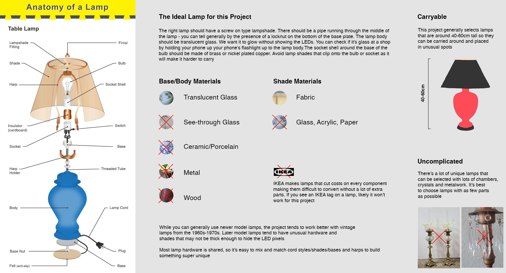
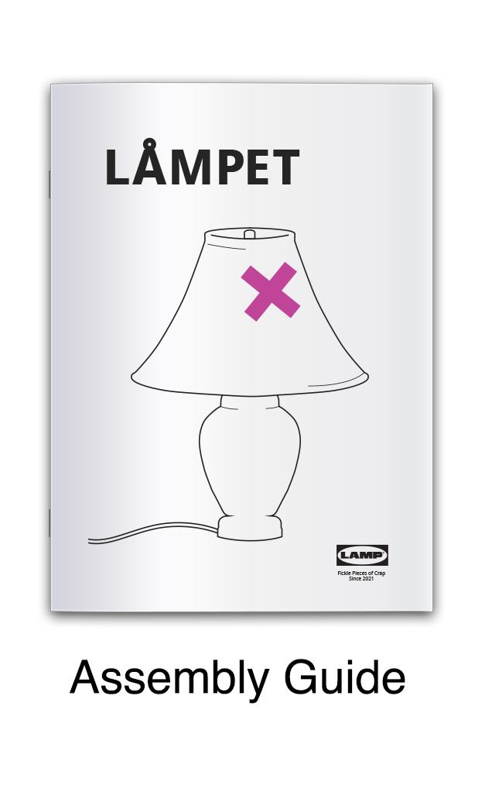
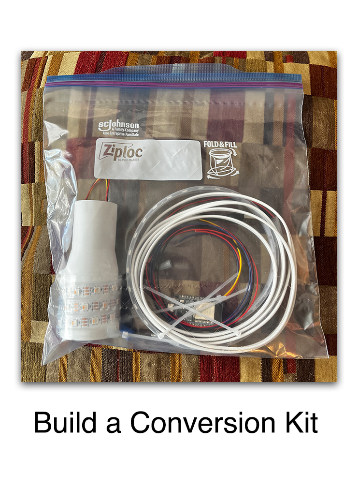

# LampOS

A platform for retrofitting traditional desk lamps with programmable LED controllers to build unique lighted art structures. Using standardized and user friendly hardware based on the ubiquitous ESP32, Neopixels and common sensors, this project seeks to simplify the job of building curious and surreal LED projects for the community to enjoy.

## Lamp Personality & Behaviours

The vision for the lamps is that they remain mostly still and static, as a contrast to the plethora of sound reactive and blinky light art out there. The brightness of the lamps and the colorful glowing base draws attention to the juxtaposition of an ordinary household object in extraordinary places.

Within this vision there is room for the lamps to have personality, shown through subtle behaviour based on things like time, randomness, sensor data, presence/absence of other lamps, etc.

With these sorts of subtle changes, people may begin to realize things are not as static as they seem, creating a somewhat complex puzzle for people to solve and talk about.

## Selecting a lamp to convert

## Build Tutorials

## Lamp OS

More details about Lamp OS and other supporting tools can be found in the [software](software/) folder
